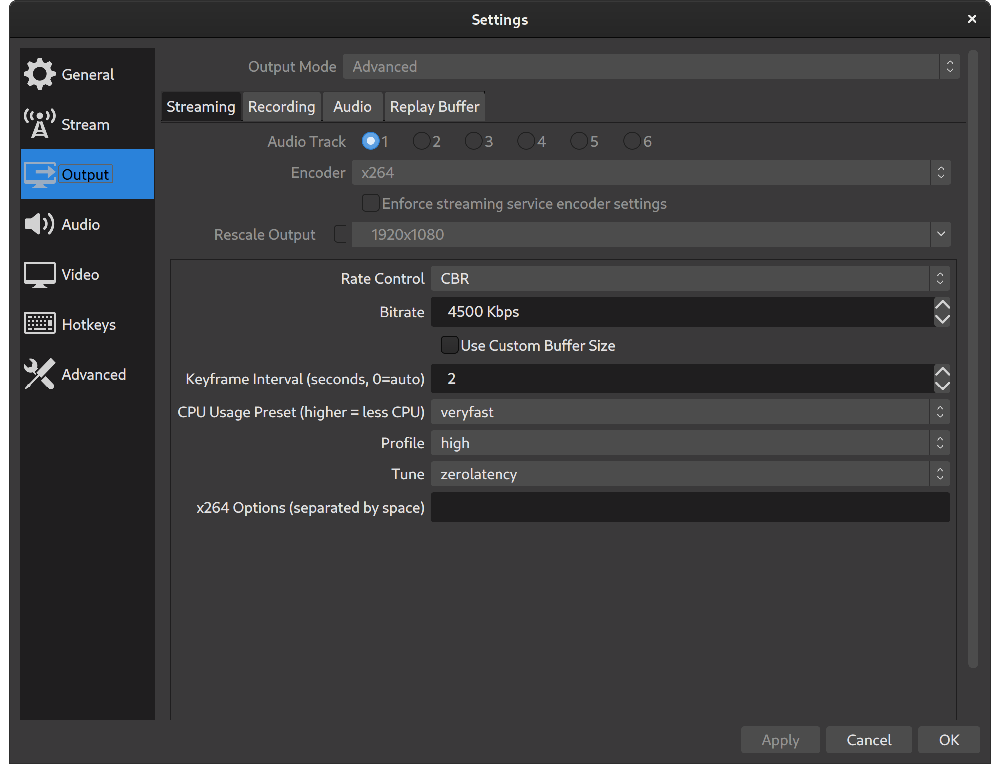

# Streaming Docs

A great part about Twitch and other streaming platforms is that you can stream from almost any device. This allows for more natural conversations. However, when you start pulling in multiple people for a chat, streaming it, adding graphics to the stream, etc. things get complicated.

"Streamers" are the term we're using for the folks that are responsible for getting everyone on a call and streaming that out to the internet. Streamers are the folks that will be the ones making sure the stream lands on Twitch/YouTube/etc.

There are some requirements though for streaming. In general, the gotchas for streaming are:

## Bandwidth

If you have a lower end upload speed, streaming is possible but 720p and 1080p streams require at least 5 Mbps of bandwidth. Keep in mind, other things on your network contend for this bandwidth. While we don't intend to stream in 4K initially, the bandwidth requirements for broadcasting 4K video is 25 Mbps.

## Equipment

Streamers will need to consider how they will both broadcast a stream while participating in it. While this is possible with a powerful enough computer, many folks choose to use two computers to stream and participate.

Computer A will be the box from which you speak and present to the audience (via a video teleconferencing solution). This is similar to joining BlueJeans/Zoom/etc. calls.

Computer B will be the machine that runs [OBS](https://obsproject.com/) to broadcast the video teleconferencing window to the streaming platforms. This computer should be able to handle the demand for streaming (for example, an 8th gen Intel i3 is the minimum platform being recommended). The good news is there are other people capable of doing the streaming on your behalf, so do not feel like you have to do it all yourself.

Keep in mind, you can stream with a wide variety of devices. What you have right now as someone who participates in meetings remotely on a regular basis is likely enough to participate in a stream. With that in mind, if you're going to be a regular participant or streamer we've assembled a list of suggested equipment to help improve the experience for our viewers.

For a detailed list of suggested equipment, see the [Streaming Equipment tab in this spreadsheet](https://docs.google.com/spreadsheets/d/1ZoLJQAM6-oCC_5YO1KjM9IeO78mXDegvnDIngTzQzi8/edit?ts=5e95dcd5#gid=1483729067) (Red Hat only). Twitch also has its own [Hardware Recommendations](https://www.twitch.tv/creatorcamp/en/setting-up-your-stream/hardware-recommendations/) if you'd like to compare options.

There is a good presentation put together by the brand team that will help you make the most of your physical appearance. Ideally, you have a decent mic, good lighting, and are wearing Red Hat or neutrally colored clothing: [Webcam Video
Best practices for presentations](https://docs.google.com/presentation/d/1xnW3hm-jDfwrqma-1j8vzmq4an1mJMk0Y2hQfUkKss4/edit#slide=id.g547716335e_0_260) (Red Hat only).

## OBS

[OBS](https://obsproject.com/), short for Open Broadcaster Software, is an open source project designed to making streaming easier and more professional looking. OBS is the interface to streaming services like Twitch, YouTube, etc. There are a number of useful resources across the web to help you get up and running with OBS or one of its forks.

### OBS Resources

* [OBS Forum Resources](https://obsproject.com/forum/resources/)
* [General Performance And Encoding Issues](https://obsproject.com/wiki/General-Performance-and-Encoding-Issues)

### OBS problems and how to fix them (aka Settings)

Error: `Encoding overloaded! Consider turning down the video settings of using a faster preset.`

This is a common error usually related to the video encoding that's occurring on the system.

Downscaling your output resolutions to 720p is the biggest thing that can be done to fix this. Also, reducing the framerate to 30 fps helps.

#### CPU Usage Preset

You should be using a setting of veryfast, superfast, or ultrafast. 

TODO:
Sound settings
Streaming key
Scenes
Sources